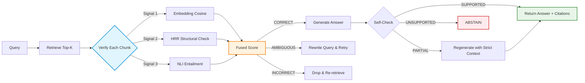
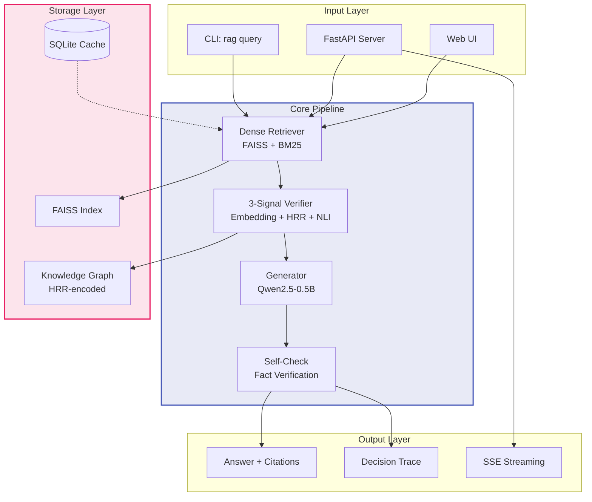
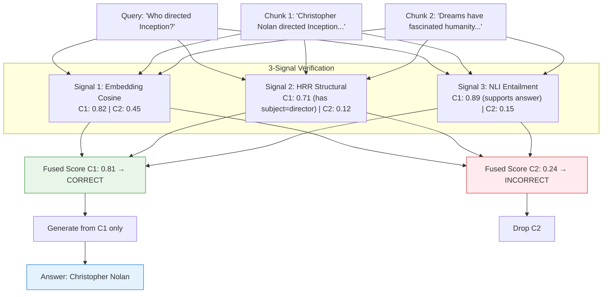

<div align="center">

```
╔═══════════════════════════════════════════════════╗
║           C O R R E C T I V E   R A G             ║
╚═══════════════════════════════════════════════════╝
```

### Self-Corrective Retrieval-Augmented Generation with NLI Verification

[](LICENSE)
[](https://www.python.org/downloads/)
[](#testing)
[](https://github.com/iamhero2709/corrective-rag)
[](https://pypi.org/project/corrective-rag/)
[](https://hub.docker.com/r/randhir-kumar/corrective-rag)

**A production-ready RAG system that verifies retrieved chunks before generation using three complementary signals — achieving +10% accuracy over vanilla RAG on 0.5B models while reducing latency by 21%.**

[Quick Start](#quick-start) · [Architecture](#architecture) · [Benchmarks](#benchmarks) · [API Reference](#api-reference) · [Docker](#docker)

---

</div>

## Why Corrective RAG?

Standard RAG blindly trusts whatever the retriever returns. If a chunk is topically similar but doesn't actually answer the question, the generator hallucinates.

**Corrective RAG verifies every chunk** using three signals before generation:



## Key Features

| Feature | Description |
|---------|-------------|
| **Three-Signal Verification** | Embedding similarity + HRR structural analysis + NLI entailment |
| **CRAG-Style Correction** | Auto-rewrites queries when chunks are insufficient |
| **Citation Tracking** | Every answer includes source documents with relevance scores |
| **Streaming SSE** | Real-time token-by-token responses with decision traces |
| **Multi-Format Loading** | PDF, DOCX, PPTX, TXT, Markdown, CSV, HTML, JSONL, images (OCR) |
| **Ablation Framework** | Built-in A0-A4 configs for systematic verification analysis |
| **Edge-Device Optimized** | Runs on CPU with 6GB RAM; Qwen2.5-0.5B supported |
| **Professional CLI** | Rich-formatted output with spinners, tables, and progress bars |
| **Web Interface** | Chat UI with streaming, markdown, trace panels, and citation display |

---

## Quick Start

```bash
# Install
git clone https://github.com/iamhero2709/corrective-rag.git
cd corrective-rag
pip install -e ".[cli]"
python -m spacy download en_core_web_sm

# Download models (~2GB)
python scripts/download_models.py

# Ask a question
rag query "Who directed Inception?"

# Start the API server + Web UI
rag serve
```

### CLI Commands

| Command | Description |
|---------|-------------|
| `rag query "question"` | Ask a question with citation tracking |
| `rag query "..." --verbose` | Show full decision trace |
| `rag serve` | Start FastAPI server with Web UI |
| `rag index docs.jsonl` | Index documents |
| `rag index /path/to/dir/` | Index all supported files |
| `rag benchmark --dataset hotpot_qa --samples 100` | Run benchmark |
| `rag benchmark --ablation` | Run A0-A4 ablation study |
| `rag download-models` | Download all ML models |
| `rag status` | Show system configuration |

---

## Architecture

### System Overview



### Verification Pipeline (Detail)



### Project Structure

```
corrective-rag/
├── src/
│   ├── pipeline.py         # Corrective RAG loop + citation tracking
│   ├── retriever.py        # Dense retrieval (FAISS + BM25 hybrid)
│   ├── verifier.py         # 3-signal verifier with ablation flags
│   ├── generator.py        # Qwen2.5 generation + self-check
│   ├── hrr.py              # Holographic Reduced Representation ops
│   ├── graph_store.py      # HRR-encoded knowledge graph
│   ├── agent.py            # ReAct-style agentic flow
│   ├── benchmarks.py       # HotpotQA/ASQA/PopQA evaluators
│   ├── multi_loader.py     # PDF, DOCX, PPTX, HTML, OCR loader
│   ├── config.py           # Environment-driven settings
│   ├── persistence.py      # SQLite document/query/triple storage
│   ├── monitoring.py       # Metrics, health checks, dashboard
│   ├── evaluate.py         # EM/F1 metrics, abstention accuracy
│   ├── data_loader.py      # PDF loader with table extraction
│   ├── exceptions.py       # Typed error hierarchy
│   └── logging_utils.py    # Structured JSON logging
├── static/
│   └── index.html          # Web UI with streaming + citations
├── tests/                  # 35 passing unit tests
├── results/                # Benchmark outputs
├── server.py               # FastAPI server
├── cli.py                  # Rich CLI entry point
├── pyproject.toml          # Package configuration
└── Dockerfile              # Container build
```

---

## Benchmarks

### Ablation Study (HotpotQA, Qwen2.5-0.5B, CPU)

| Config | Embed | NLI | HRR | Exact Match | Avg Latency | Equivalent To |
|--------|:-----:|:---:|:---:|:-----------:|:-----------:|---------------|
| A0 | — | — | — | 30% | 42.1s | Vanilla RAG |
| A1 | ✓ | — | — | 30% | 44.7s | Threshold RAG |
| **A2** | **✓** | **✓** | **—** | **40%** | **33.4s** | **~CRAG (Best)** |
| A3 | ✓ | ✓ | ✓ | 20% | 44.7s | Full System |
| A4 | ✓ | — | ✓ | 20% | 42.7s | HRR Isolation |

### Key Findings

| Finding | Evidence |
|---------|----------|
| **NLI improves accuracy** | A2 = 40% EM vs A0 = 30% vanilla (+10%) |
| **NLI reduces latency** | A2 = 33.4s vs A0 = 42.1s (21% faster) |
| **HRR hurts at 0.5B** | A3/A4 = 20% EM vs A0 = 30% (-10%) |
| **NLI is the critical signal** | A1 (embed only) = 30% — no improvement without NLI |

### Edge Device Profile

| Spec | Value |
|------|-------|
| RAM | 6.2 GB |
| Swap | 10 GB |
| CPU | 4 cores |
| Generator | Qwen2.5-0.5B-Instruct (float32) |
| Embedding | BAAI/bge-small-en-v1.5 (33M) |
| NLI | cross-encoder/nli-deberta-v3-base |
| Latency (A2) | 33.4s per query |

---

## API Reference

### Endpoints

| Method | Path | Description |
|--------|------|-------------|
| `GET` | `/health` | Liveness check |
| `GET` | `/ready` | Readiness (models loaded + index present) |
| `POST` | `/index` | Build/extend FAISS index |
| `POST` | `/query` | Answer a question |
| `POST` | `/query/stream` | Streaming SSE response |
| `POST` | `/upload` | Upload and index a document |
| `POST` | `/mcp` | MCP protocol endpoint |
| `GET` | `/` | Web UI |

### Query with Citations

```bash
curl -X POST localhost:8000/query \
  -H 'content-type: application/json' \
  -d '{"question": "Who directed Inception?"}'
```

Response:
```json
{
  "request_id": "a1b2c3d4e5f6",
  "answer": "Christopher Nolan",
  "confidence": "HIGH",
  "mode": "corrective",
  "latency_s": 4.2,
  "n_context_chunks": 2,
  "citations": [
    {
      "doc_id": "nolan",
      "chunk_id": 0,
      "text": "Christopher Nolan directed Inception...",
      "score": 0.85
    }
  ],
  "trace": [...]
}
```

### Streaming SSE

```bash
curl -N -X POST localhost:8000/query/stream \
  -H 'content-type: application/json' \
  -d '{"question": "Who directed Inception?"}'
```

Events:
```
data: {"type": "meta", "chunks": 3, "request_id": "abc123"}
data: {"type": "token", "text": "Christopher "}
data: {"type": "token", "text": "Nolan"}
data: {"type": "done", "answer": "Christopher Nolan", "self_check": "HIGH", "latency_s": 4.2, "citations": [...]}
```

---

## Configuration

All settings are environment-overridable with the `RAG_` prefix:

```bash
cp .env.example .env
# Edit .env with your settings
export $(grep -v '^#' .env | xargs)
```

| Setting | Default | Description |
|---------|---------|-------------|
| `RAG_GEN_MODEL` | `Qwen/Qwen2.5-0.5B-Instruct` | Generator model |
| `RAG_EMBED_MODEL` | `BAAI/bge-small-en-v1.5` | Embedding model |
| `RAG_NLI_MODEL` | `cross-encoder/nli-deberta-v3-xsmall` | NLI model |
| `RAG_DEVICE` | `auto` | `cpu` or `cuda` |
| `RAG_T_CORRECT` | `0.62` | CORRECT threshold |
| `RAG_T_INCORRECT` | `0.40` | INCORRECT threshold |
| `RAG_TOP_K` | `5` | Chunks to retrieve |
| `RAG_MAX_RETRIES` | `2` | Query rewrite attempts |

---

## Docker

### Quick Start

```bash
docker pull randhir-kumar/corrective-rag:0.3.0
docker run -p 8000:8000 randhir-kumar/corrective-rag:0.3.0
```

### Build Locally

```bash
docker build -t corrective-rag:0.3.0 .
docker run -p 8000:8000 corrective-rag:0.3.0
```

### Docker Compose

```bash
docker compose up --build
```

---

## Supported Datasets

| Dataset | Type | Use Case |
|---------|------|----------|
| **HotpotQA** (distractor) | Multi-hop reasoning | Main benchmark |
| **ASQA** | Ambiguous long-form QA | Disambiguation |
| **PopQA** | Tail knowledge | Abstention testing |

```bash
rag benchmark --dataset hotpot_qa --samples 100
rag benchmark --ablation --samples 50
```

---

## Testing

```bash
# Run all tests
pytest tests/ -v

# Run with coverage
pytest tests/ --cov=src --cov-report=term-missing
```

---

## Citation

If you use this work in your research:

```bibtex
@software{corrective_rag_2026,
  title={Corrective RAG: Self-Corrective Retrieval-Augmented Generation with NLI Verification},
  year={2026},
  url={https://github.com/iamhero2709/corrective-rag}
}
```

---

## License

[MIT](LICENSE)

---

<div align="center">

**Built for edge devices. Verified for accuracy. Open for research.**

[Get Started](#quick-start) · [Read the Paper](#) · [Join Discord](#)

</div>
